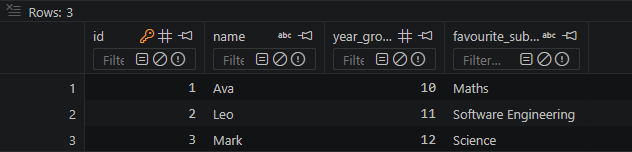

# Lesson 02 Evidence Pro-Forma

## Commit evidence (minimum 2)
- Commit 1 hash + message:
Hash : 8b93518
Message : Finished the lesson and answered all the questions as well as all the extension bits.
- Commit 2 hash + message:
Hash : 0057f25
Message : Committing my commit. No changes made to code.
- Optional Commit 3 hash + message:

## Run evidence
- Command run:
python Project_Folder/lesson2_create_table.py
- Terminal output pasted below:
There was no output in the terminal. However:

## SQL/Python changes I made
- I added an extra row for Mark and gave all of them a favourite subject in an extra column

## Error and fix
- Error I hit:
I hit many errors, mostly that it just gave me an error for creating an extra column and how I had 3 column but only 2 subjects
- How I fixed it:
I added and removed a comma when creating my table and added an extra question mark for my columns

## Understanding check (answer in your own words)
1. Why do we use `commit()`?
To save my changes
2. What does `PRIMARY KEY` mean?
A unique name to identify specific rows
3. Why is `IF NOT EXISTS` useful when creating tables?
So that if a row or column doesn't exist, it will automatically create on for you

## Quality checklist
- [✓] Script runs without unhandled errors
- [✓] I included at least 2 lesson commits
- [✓] I showed inserts and saved changes
- [✓] I answered all questions in my own words
